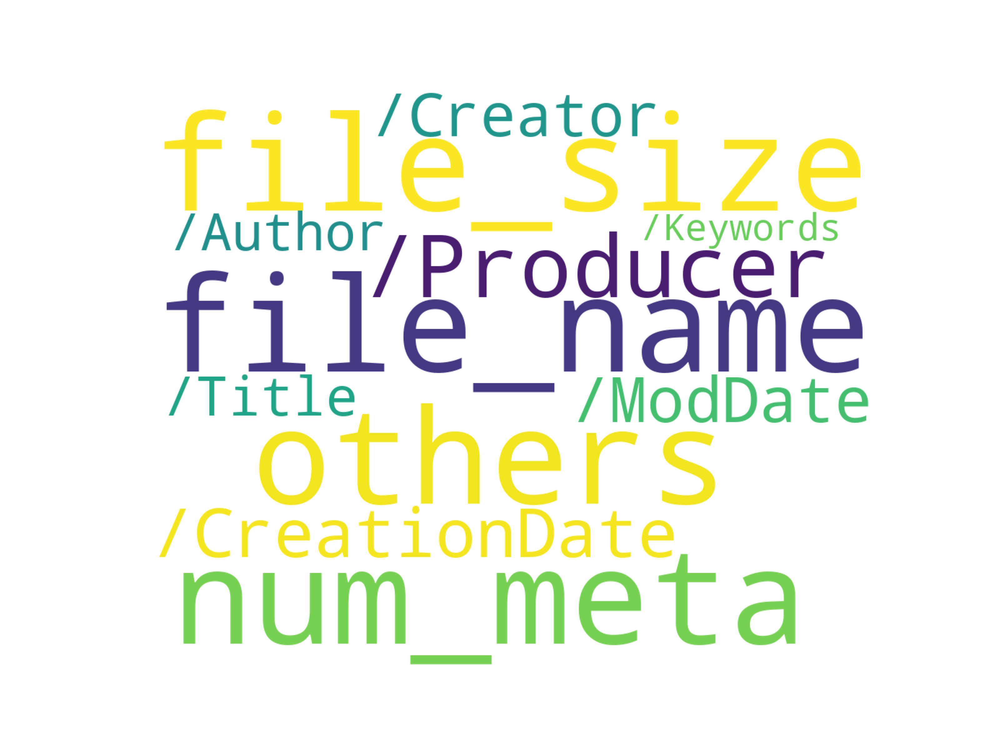

1.pdf文件解析

通过使用pikepdf解析pdf文件，获取pdf文件中的元数据，最后将这些元数据写入jsonl中进行数据分析。

2.元数据分析

pikepdf工具解析pdf文件可以获得以下元数据信息(具体可获得的元数据信息可能因PDF文件的属性而异):

> 1. 标题（Title）：PDF文件的标题。
> 2. 作者（Author）：PDF文件的作者。
> 3. 主题（Subject）：PDF文件的主题。
> 4. 关键词（Keywords）：与PDF文件相关的关键词。
> 5. 创建者（Creator）：生成PDF文件的软件或工具。
> 6. 生产者（Producer）：生成PDF文件的具体程序或库文件。
> 7. 创建日期（CreationDate）：PDF文件的创建日期。
> 8. 修改日期（ModDate）：PDF文件的修改日期。
> 9. 版本（Version）：PDF文件的版本号。

在以上元数据信息中，Creator和Producer是两个不同的属性：

创建者(Creator)通常指的是生成PDF文件的应用程序或操作系统。例如，如果PDF文件是由Adobe Acrobat创建的，那么"创建者"可能是"Adobe Acrobat"。

生产者(Producer)通常指的是生成PDF文件的具体程序或库文件。例如，如果PDF文件是由Ghostscript生成的，那么"生产者"可能是"GPL Ghostscript"。

数据分析模块：通过统计这些元数据字段出现的频率，过滤出一些低于阈值的元数据，绘画出整个元数据的词云。

示例代码中提取的元数据字段出现频率如下：

> file_name        1.000000
> file_size        1.000000
> /Author          0.557461
> /CreationDate    0.952270
> /Creator         0.756815
> /Producer        0.953745
> /Title           0.612116
> others           1.000000
> num_meta         1.000000
> /ModDate         0.825204
> /Keywords        0.230727

生成的词云如下：

